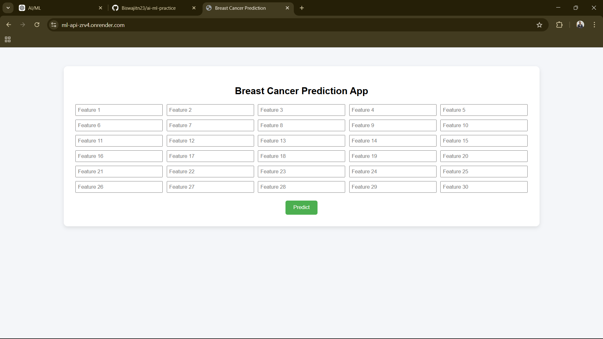
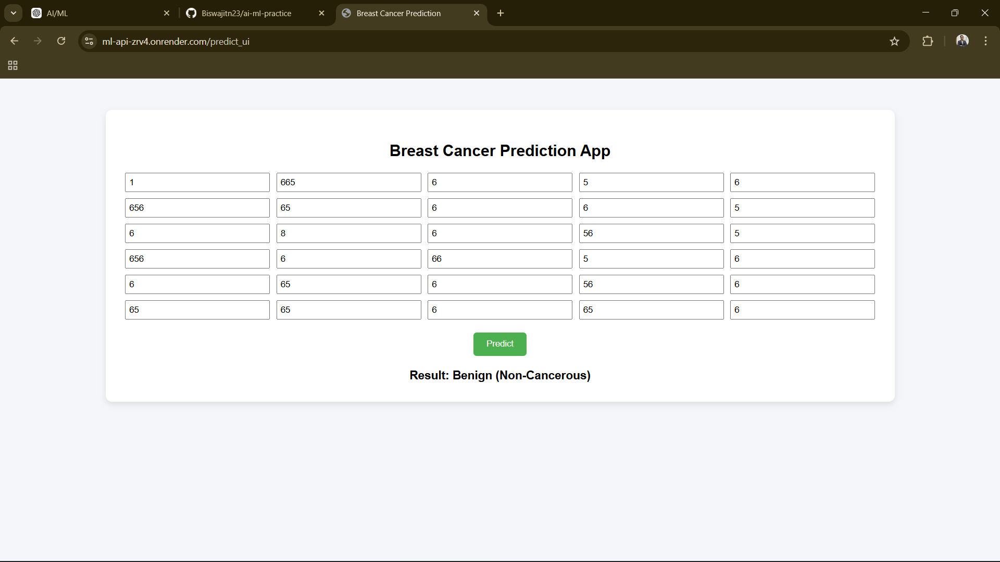
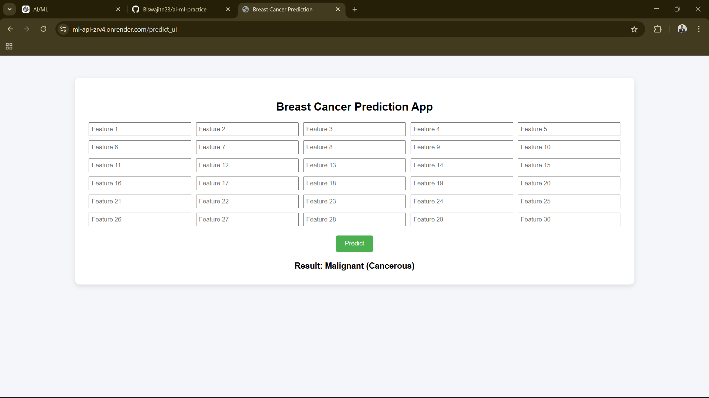
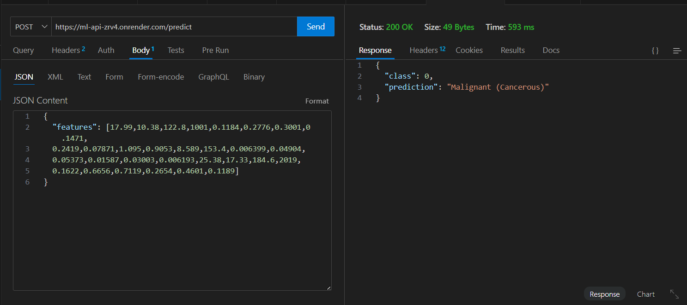

# 🧠 Breast Cancer Prediction ML Web App

A full-stack Machine Learning web application that predicts whether a tumor is malignant or benign using a trained Random Forest model.

🔗 Live Demo: https://ml-api-zrv4.onrender.com

---

## 🚀 Project Overview

This project demonstrates the complete Machine Learning workflow:

- Data preprocessing  
- Model training & evaluation  
- Model serialization  
- REST API development  
- Frontend integration  
- Cloud deployment  

The application allows users to input 30 medical features and receive a classification prediction instantly via a deployed web interface.

## ✨ Features

- ✔ Random Forest Classification Model  
- ✔ REST API Endpoint  
- ✔ Web-Based User Interface  
- ✔ Probability-Based Prediction  
- ✔ Cloud Deployment on Render  
- ✔ Input Validation & Error Handling

## 🏗 System Architecture

User → Web UI → Flask API → Random Forest Model → Prediction → Response

The trained model is serialized using Joblib and loaded inside the Flask backend to serve predictions in real-time.

## 🛠 Tech Stack

- Python  
- Scikit-Learn  
- Flask  
- HTML / CSS  
- Joblib  
- Gunicorn  
- Render (Cloud Deployment)

## 📸 Screenshots

### 🔹 Web Interface

  
  

### 🔹 Prediction Result

### 🔹 API Response
